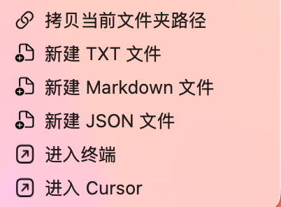

# EasyRight — macOS 右键菜单增强 + 截图工具

<p align="center">
  
  
</p>

EasyRight 是 超级右键 + PixPin 核心功能的聚合体，为 Mac用户 增加实用右键快速创建删除操作，并提供截图、录屏和长截图功能

## 主要功能

### Finder 右键增强

- 在当前文件夹或选中的文件夹中快捷新建 TXT、Markdown、JSON 文件
- 复制或移动文件到常用文件夹
- 剪切、粘贴文件
- 拷贝文件或当前文件夹路径
- 自定义文件、文件夹图标
- 快速启动或切换到终端、iTerm2、VS Code、Cursor、Sublime Text、Zed、Emacs 或 Warp
- 自动识别已安装的应用，只显示可用菜单项

右键 Finder 空白处时，也可粘贴文件、拷贝当前路径，或快速启动和切换终端与编辑器。

### 截图、贴图与录屏

| 默认快捷键 | 功能 |
| --- | --- |
| `⌘1` | 区域截图 |
| `⌘2` | 自动滚动长截图 |
| `⌘3` | 开始 / 停止录屏 |

- 截图完成后会显示截图预览及下方的标注工具栏；点击工具栏中的「贴图」后图片会一直保留到手动关闭
- 截图可按设置自动复制到剪贴板或保存文件
- 贴图支持移动、缩放、画笔、箭头、矩形、文字、撤销和导出
- 录屏支持区域 / 全屏、15–60 FPS、MP4（H.264）和 MOV（HEVC）
- 录屏会自动排除 EasyRight 的控制条、选区框和贴图窗口
- 所有快捷键均可修改，也可从菜单栏直接触发功能

默认截图目录：`~/Pictures/EasyRight`

## 安装

运行：

```bash
./install.sh
```

脚本会编译应用、安装到 `/Applications`、启动主程序并启用 Finder 扩展。只需安装 Xcode 命令行工具：

```bash
xcode-select --install
```

开发时可运行 `swift run EasyRightTests` 验证长截图拼接算法和指令鉴权；`./build.sh` 会按源码指纹复用未变化的二进制，需要全量重建时运行 `./build.sh clean`。

如果右键菜单未出现，请前往：

> 系统设置 → 通用 → 登录项与扩展 → Finder 扩展

然后启用「EasyRight 扩展」。

## 个人分发打包

直接运行打包脚本：

```bash
./package.sh
```

脚本默认使用 ad-hoc 签名，构建并验证主应用、Finder 扩展和 DMG，最终产物位于 `dist/`。DMG 使用标准拖拽安装界面，包含 `EasyRight.app`、指向系统 `/Applications` 的快捷方式及界面背景；不会打包证书、私钥、安装说明或其他本机文件。

朋友首次安装时，把 `EasyRight.app` 拖到“应用程序”，再从“应用程序”中打开一次，然后前往“系统设置 → 隐私与安全性”点击“仍要打开”。应用会自动推出仍挂载的安装 DMG、清理镜像内的重复 Finder 扩展注册，并保留用户已经做出的启用选择。之后按需授权屏幕录制和辅助功能即可。

如需让同一台 Mac 上的后续覆盖安装尽量维持一致代码身份、减少重新授予 TCC 权限的情况，也可以在钥匙串中创建并信任固定的代码签名证书，然后运行：

```bash
CODESIGN_IDENTITY="你的代码签名证书名称" ./package.sh
```

固定自签名是可选项，并不等于 Apple Developer ID；安装 Xcode 也不会自动获得 Developer ID。面向普通用户的无提示分发需要 Apple Developer ID 签名和公证。

## 权限

| 权限 | 用途 |
| --- | --- |
| 屏幕录制 | 截图、录屏和长截图 |
| 辅助功能 | 长截图时自动滚动页面 |

首次使用相关功能时，macOS 会引导授权。首次操作桌面、文稿、下载等目录时，也请允许文件访问。

## 设置

双击“应用程序”中的 EasyRight，或点击菜单栏图标中的「偏好设置」，都会打开 Dashboard：

- **概览**：检查 Finder 扩展、屏幕录制和辅助功能的真实系统状态，并直接打开对应设置
- **右键菜单**：管理常用文件夹，以及快捷新建、路径、剪切粘贴等菜单项
- **截图与录屏**：修改快捷键、保存目录和截图后行为

配置会立即生效，并保存在：

```text
~/Library/Application Support/EasyRight/config.json
```

## 实现概览

```text
EasyRight.app                    主应用：菜单栏、设置和实际操作
└── PlugIns/EasyRightExt.appex   Finder 扩展：生成菜单并转发指令
```

Finder 扩展运行在沙盒中，仅负责菜单展示；文件操作由主应用执行。两者通过带本机随机令牌认证的 `easyright://` URL Scheme 通信。

```text
Sources/Shared/      配置、快捷键和指令模型
Sources/App/         主应用、截图、录屏、贴图与长截图
Sources/Extension/   Finder Sync 扩展
Resources/           Info.plist 与扩展授权配置
build.sh             编译、打包和签名
install.sh           一键安装
```

## 卸载

```bash
pluginkit -e ignore -i com.diy.easyright.app.ext
pkill -x EasyRight; pkill -x EasyRightExt
rm -rf /Applications/EasyRight.app "$HOME/Library/Application Support/EasyRight"
```
